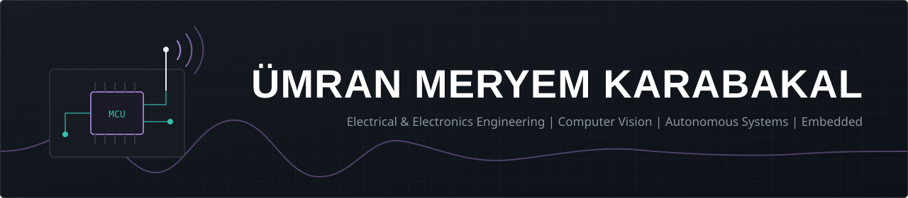
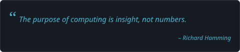
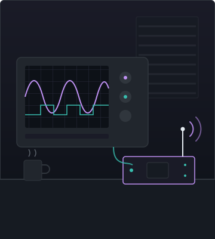
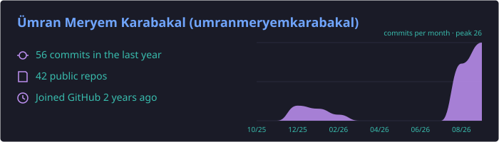
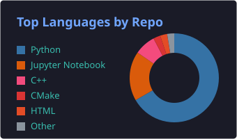
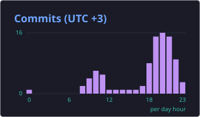
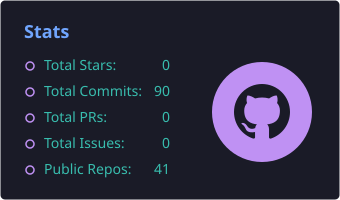
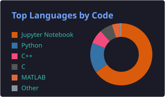

## 🎯 About me

<table>
<tr>
<td width="58%" valign="top">

```c
const struct engineer umran = {
    .role     = "EEE student",
    .school   = "Istanbul Medeniyet University",
    .location = "Istanbul, Türkiye",

    .building = {
        "ESP32-S3 firmware (ESP-IDF, FreeRTOS)",
        "SDR and RF links (bladeRF)",
        "INDI control (Simulink, PX4 SITL)",
    },

    .research = {
        "TÜBİTAK 1505: GSM victim localization",
        "ASYU 2026: video-based modem diagnostics",
    },

    .learning = {
        "Embedded and wireless security",
        "Secure boot and OTA",
        "RTOS internals",
    },
};
```



</td>
<td width="42%" valign="middle" align="center">

</td>
</tr>
</table>

<details>
<summary>🇹🇷 Türkçe</summary>
<br />

İstanbul Medeniyet Üniversitesi Elektrik-Elektronik Mühendisliği öğrencisiyim. Gömülü sistemler, RF ve kablosuz haberleşme ile kontrol sistemleri üzerine çalışıyorum.

- **Şu an:** ESP32-S3 üzerinde ESP-IDF + FreeRTOS ile firmware, bladeRF ile SDR tabanlı RF çalışmaları, MATLAB/Simulink'te INDI kontrolcü tasarımı ve PX4 SITL doğrulaması.
- **Araştırma:** TÜBİTAK 1505 kapsamında NVIDIA Jetson üzerinde GSM tabanlı afetzede konumlandırma. Görüntü işleme ile modem arıza ön tespiti çalışması (TÜBİTAK 2209-B) ASYU 2026'da bildiri olarak kabul edildi.
- **Öğreniyorum:** gömülü ve kablosuz sistem güvenliği, secure boot ve OTA, RTOS iç yapısı.

</details>

## 📫 Connect with me

<p align="center">
  <a href="https://www.linkedin.com/in/umran-meryem-karabakal/"></a>
  <a href="https://github.com/umranmeryemkarabakal"></a>
</p>

## 🛠️ Tech stack

<p align="center">
  
</p>

<p align="center">
  
  
  
  
  
  
  
  
  
  
</p>

## 📊 GitHub analytics

<p align="center">
  
</p>
<p align="center">
  
  
</p>
<p align="center">
  
  
</p>

## 🏆 GitHub trophies

<p align="center">
  
</p>
